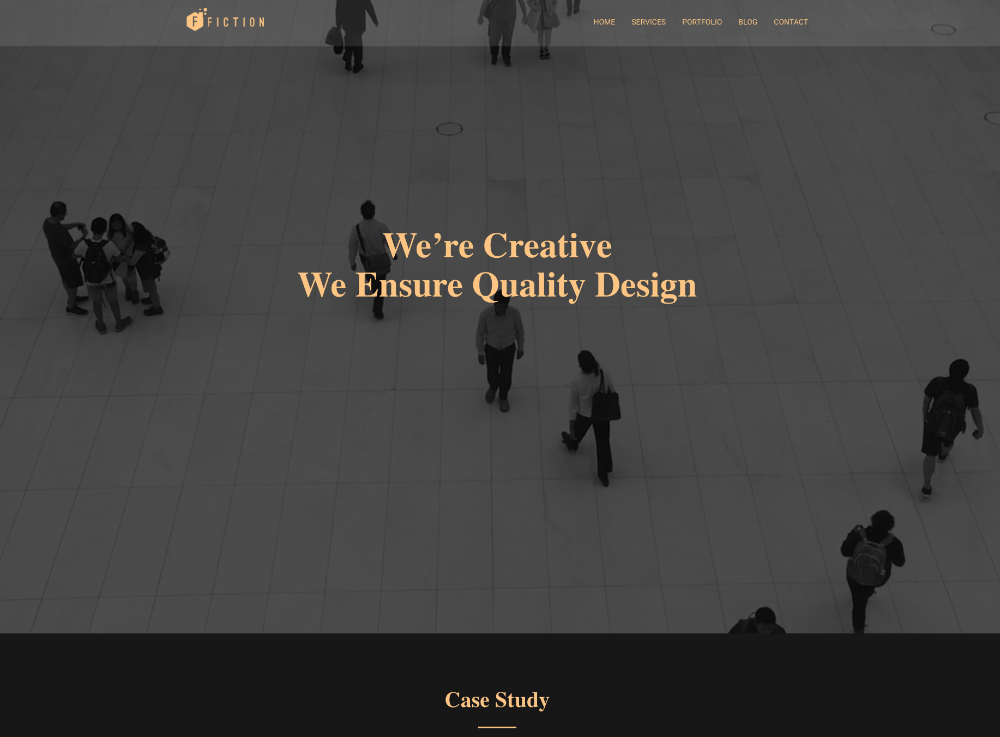

# Fiction

Template for Hugo. Browse through a [live demo](https://scenic-sea.cloudvent.net/). This theme has been adapted from the MIT-licensed [Fiction Bootstrap template from Theme Fisher](https://themefisher.com/products/fiction-bootstrap-agency-template/).

Fiction was made by [Themefisher](https://themefisher.com/) and converted to Hugo by [CloudCannon](https://cloudcannon.com/), a Jamstack platform for the whole team.

## Features

* Pre-built pages
* Pre-styled components
* Contact form
* Blog with pagination and category pages
* Configurable navigation and footer
* Multiple hero options - single image, image slider and video
* Optimised for editing in [CloudCannon](https://cloudcannon.com/)
* Configurable search engine optimisation
* Search using [Pagefind](https://pagefind.app/)

## Setup

Get a workflow going to see your site's output (with [CloudCannon](https://app.cloudcannon.com/) or Hugo locally).

## Develop

Fiction was built with [Hugo](https://gohugo.io/) version `0.96.0`, but should support newer versions as well.
### Prerequisites
* Hugo [install](https://gohugo.io/getting-started/installing/). `brew install hugo`
* Go [install](https://go.dev/learn/). `brew install go`

### Quickstart
1. In the terminal at the root dir, run: `npm i`
2. Start site and bookshop: `npm run dev` OR site alone: `npm run start`
* By default bookshop live browser will be at : [http://localhost:30775/](http://localhost:30775/)
* By default the site will be at : [http://localhost:1313/](http://localhost:1313/)

## Editing

Fiction is set up for adding, updating and removing pages, components, posts, portfolio items, company details and footer elements in [CloudCannon](https://app.cloudcannon.com/).

### Company details

* Reused around the site to save multiple editing locations.
* Set in the *Data* / *Company* section.

### Nav/footer details

* Reused around the site to save multiple editing locations.
* Set in the *Data* section with respective names

### Map

To use the google maps functionality within the site you will need to add your api key to *Data* / *Company* under the `google_maps_api_key` variable.

To see more about getting an api key see the [documentation](https://developers.google.com/maps/documentation/javascript/get-api-key).

### Hero component

There are three different hero components that are designed to be used at the top of the index page. They can be changed in the index page using [CloudCannon](https://app.cloudcannon.com/) live editing or locally.

#### Image hero

This component uses a single image behind some heading text

#### Slider hero

This component uses any number of images behind some heading text

#### Video hero

This component uses a video behind some heading text

